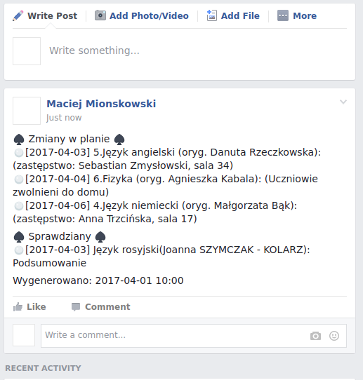

# UONET TO FB

A simple script utilizing [uonet-sdk](https://github.com/VLO-GDA/uonet-sdk) to post changes in the timeline and exams on a FB group.
i

## Setting up:

### Fetching
- Register new application on UONET platform
- Make register request to obtain certificate
- Supply fetched certificate keys in UONET2FB.java

### Publishing:
- Obtain facebook App key
- Obtain admin privileges in fb group
- Create a post and preferably pin it
- Get post's ID
- Supply obtained values in ./publish.sh